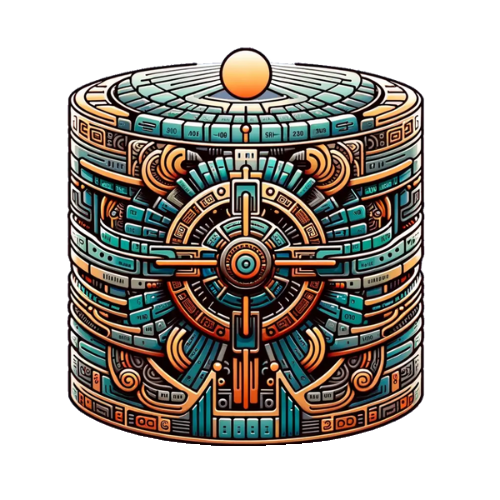

# Quipubase TypeScript Client

Welcome to the official TypeScript client for the **Quipubase API**. This client provides a convenient interface for working with Quipubase resources, including collections, objects (Pub/Sub), vectors, live queries, and file storage (blobs). Built on top of `axios`, `zod`, and the `@openai/openai` client, it offers a consistent developer experience with strong typing and modern conventions.

---



API Docs

[Quipubase API Docs](https://quipubase.oscarbahamonde.com/docs)

---

## 📦 Installation

Use npm or yarn to install the client:

```bash
npm install quipubase
# or
yarn add quipubase
```

---

## 🚀 Getting Started

```ts
import { Quipubase } from "quipubase";

const client = new Quipubase({
  baseURL: "https://quipubase.oscarbahamonde.com/v1", // Replace with your base URL
  apiKey: "YOUR_API_KEY",
});

async function main() {
  try {
    const collections = await client.collections.list();
    console.log("Successfully connected to Quipubase!");
    console.log(collections);
  } catch (e) {
    console.error("Connection failed:", e);
  }
}

main();
```

---

## 📚 Collections

Create, list, retrieve, and delete collections. Each collection is defined by a JSON Schema.

```ts
const schema = {
  type: "object",
  properties: {
    user_id: { type: "string" },
    post_content: { type: "string" },
    timestamp: { type: "string", format: "date-time" },
  },
  required: ["user_id", "post_content"],
};

const newCollection = await client.collections.create({ json_schema: schema });
const retrieved = await client.collections.retrieve({ collection_id: newCollection.id });
await client.collections.delete({ collection_id: newCollection.id });
```

---

## 🔄 Objects (Pub/Sub)

Publish and subscribe to real-time events (create, update, delete) for objects in a collection.

```ts
await client.objects.pub({
  collection_id: "your_collection_id",
  event: "create",
  data: { user_id: "123", post_content: "Hello World" },
});

for await (const event of client.objects.sub({ collection_id: "your_collection_id" })) {
  console.log("Received event:", event);
  break;
}
```

---

## 🧠 Vectors (Semantic Search)

Store and search vector embeddings using pre-defined models (e.g., `gemini-embedding-001`).

```ts
await client.vector.upsert({
  namespace: "my-docs",
  input: ["Text A", "Text B"],
  model: "gemini-embedding-001",
});

const results = await client.vector.query({
  namespace: "my-docs",
  input: "What is Text A about?",
  top_k: 1,
  model: "gemini-embedding-001",
});
```

---

## 🔍 Live Query

Run SQL-like queries on live datasets from files, MongoDB, or PostgreSQL sources.

```ts
await client.query.create({
  engine: "file",
  uri: "data.csv",
  query: "SELECT * FROM root",
  key: "csv-dataset",
});

const data = await client.query.retrieve({
  key: "csv-dataset",
  query: "SELECT * FROM `root` LIMIT 5",
});

await client.query.delete({
  key: "csv-dataset",
  bucket: "quipu-store",
  namespace: "default",
});
```

---

## 🗃️ Blobs (File Storage)

Upload, retrieve, and delete binary data such as images, PDFs, or audio files.

```ts
import { readFileSync, writeFileSync, unlinkSync } from "fs";

const fileContent = "Hello Blob!";
writeFileSync("file.txt", fileContent);

await client.blobs.create({
  path: "uploads/file.txt",
  file: readFileSync("file.txt"),
  bucket: "my-bucket",
});

await client.blobs.retrieve({
  path: "uploads/file.txt",
  bucket: "my-bucket",
});

await client.blobs.delete({
  path: "uploads/file.txt",
  bucket: "my-bucket",
});

unlinkSync("file.txt"); // Cleanup
```

---

## ✅ Requirements

- Node.js v18+
- TypeScript v4.5+
- Quipubase API Key

---

## 🧪 Development

This package is under active development. Contributions and feedback are welcome!

---

## 🧾 License

MIT © 2025 [Oscar Bahamonde](https://github.com/bahamondeX)

---